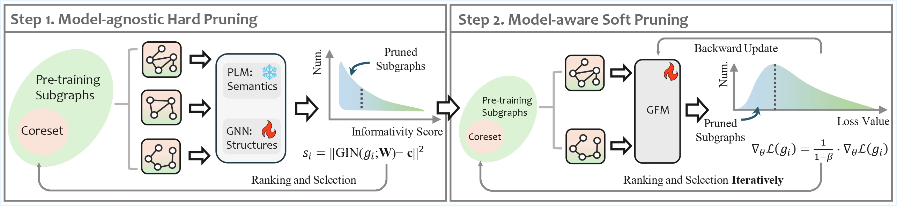

<h1 align="center"> Advancing Graph Foundation Models: A Data-Centric Perspective </h1>

This is the code repository for our KDD 2025 paper, "Advancing Graph Foundation Models: A Data-Centric Perspective".

**DCGFM** is a play-and-plug approach for data-centric GFM from the data pruning perspective. First, to mitigate redundancy and noise issues, a model-agnostic hard pruning module is employed to filter out less informative subgraphs. Second, to improve efficiency during training, a model-aware soft pruning module is utilized to filter out several pre-training subgraphs that contribute less to the current GFM in each epoch.



## Setup Environment

```shell
conda env create -f environment.yml
```

We evaluate DCGFM on two representative GFM backbones, i.e., OFA and GraphCLIP.

## OFA with DCGFM

For a Colab-oriented walkthrough focused on the OFA molecular graph workflow, see [OFA/README_COLAB.md](/Users/ehmadsaeed/MS-AI/CS5312%20Big%20Data%20Analytics/Research%20Project/DCGFM/OFA/README_COLAB.md).

### Data preparation
Most datasets can be downloaded automatically by the code, and here are the datasets and models requiring manual download.

Please download the following model and place it in the `OFA/cache_data/model` directory:

|Model  | Links |  
|--|--|
|Sentence-Bert|[HuggingFace](https://huggingface.co/sentence-transformers/multi-qa-distilbert-cos-v1)|

Please unzip the following dataset and place it in the `OFA/cache_data/dataset` directory:

|Dataset  | Links |  
|--|--|
|molecule_property_instruction|[HuggingFace](https://huggingface.co/datasets/haitengzhao/molecule_property_instruction)|


### Pre-training and Testing with DCGFM

```
cd OFA/
CUDA_VISIBLE_DEVICES=0 python run_cdm.py --control_gpu --gpus 0 --save_model --override yamls/soft_and_hard.yaml --hard_pruning_mode hard_prune_api --hard_pruning_joint --hard_pruning_reverse  --hard_pruning_ratio 0.3/0.5/0.7 --prune_ratio 0.3/0.5/0.7      
```

## GraphCLIP with DCGFM

### Data preparation

Please follow the GraphCLIP's repo to download the following pre-training datasets and unzip the files and place them in the `summary` directory:

|Datasets  | Links |  
|--|--|
|OGBN-ArXiv|[Google Drive](https://drive.google.com/file/d/1AeAnnqPui05FuBX7JvWQMJA8kr2CIFYS/view?usp=sharing)|
| ArXiv\_2023| [Google Drive](https://drive.google.com/file/d/1t1icJvRtw9OBpc88uws_wIsKFoVHtM0D/view?usp=sharing)|
| Reddit|[Google Drive](https://drive.google.com/file/d/1c7gtoy918suLlUN5a8CYUGCEbzYAeSeX/view?usp=sharing) |
|OGBN-Products|[Google Drive](https://drive.google.com/file/d/1IAmU8mAJ-rVzFu1iOkvQes1RtS8-RU-M/view?usp=sharing)|


For target datasets, we only need to download processed data, unzip them and put them into `processed_data` directory:

|Datasets  | Links |  
|--|--|
|WikiCS|[Google Drive](https://drive.google.com/file/d/1vOo_Iql19Eccgr8t6H70AYIvxwu87846/view?usp=sharing)|
|Instagram|[Google Drive](https://drive.google.com/file/d/1c9ZkdHyDHKaInGnmXlLGjYIPeTY-njF7/view?usp=sharing)|
|Ele-Photo|[Google Drive](https://drive.google.com/file/d/1qFMixgszCODpo7e7syhucUjKYr75T8cx/view?usp=sharing)|
|Ele-Computers|[Google Drive](https://drive.google.com/file/d/1487we3C9AJryvAMCCH0W7YA0nXFQ1H8o/view?usp=sharing)|
|Books-History|[Google Drive](https://drive.google.com/file/d/1zAlK6BdQy0YmwPu9M5GXbImLrDQS4BON/view?usp=sharing)|

Please run `bash gen_target_subg.sh` to generate subgraphs for each target dataset.

### Pre-training from scratch with DCGFM

#### Step1: Model-agnostic Hard Pruning

```
cd GraphCLIP/

python hard_pruning.py --source_data ogbn-arxiv+arxiv_2023+pubmed+ogbn-products+reddit --threshold 30/50/70
```

#### Step2: Model-aware Soft Pruning

```
CUDA_VISIBLE_DEVICES=0,1,2,3 python train.py --source_data ogbn-arxiv+arxiv_2023+pubmed+ogbn-products+reddit --batch_size 7200 --epochs 30
```

### Evaluation

```
CUDA_VISIBLE_DEVICES=0 python eval.py --target_data cora+citeseer+wikics+instagram+photo+computer+history --ckpt graphclip
```
